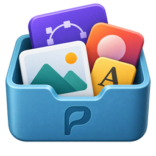

<div align="center">



# Pigoune

**P**latform for **I**cons and **G**raphics **O**rganized, **U**nified, **N**ative and **E**legant

*All your graphic assets, organized and within reach.*

[](COPYING)
[](https://www.gnome.org)
[](https://gtk-rs.org)
[](https://github.com/Gor3pig/Pigoune/releases/latest)

**English** · [Français](README.fr.md)

[Features](#features) · [Principles](#principles) · [Installation](#installation) · [Guide](#user-guide) · [Contributing](#contributing)


</div>

---

> [!NOTE]
> **Pigoune 1.1.0 is available.** [Download the Flatpak package](https://github.com/Gor3pig/Pigoune/releases/latest)
> to try it.

## What is Pigoune?

Icons in `Downloads`, logos in an old project folder, an SVG lost somewhere on the desktop…
**Pigoune gathers all of them in a single library**, neatly organized and pleasant to browse.

Drop your graphic assets in: Pigoune keeps a safe copy (your original files are never
touched), helps you organize them and hands them back with a simple drag and drop whenever
you need them.

## Features

<table>
<tr>
<td width="50%" valign="top">

### Drop
Drag files or whole folders: SVG, PNG, JPEG, WebP, GIF and ICO. Every image is checked before
it comes in, and duplicates are recognized automatically.

</td>
<td width="50%" valign="top">

### Organize
Nested collections, tags and favorites, plus a note, a source, a license and an author for each
asset.

</td>
</tr>
<tr>
<td width="50%" valign="top">

### Find
Instant search and filters by type or favorite, even among thousands of assets. Clicking a
collection or a tag shows you where an asset lives.

</td>
<td width="50%" valign="top">

### Reuse
Drag an asset into any application, copy it to the clipboard or export it to a folder.

</td>
</tr>
<tr>
<td width="50%" valign="top">

### Enjoy
A thumbnail grid with adjustable size, animated GIFs on hover, and a detailed preview with zoom
at the press of <kbd>Space</kbd>.

</td>
<td width="50%" valign="top">

### Relax
The trash and undo with <kbd>Ctrl</kbd>+<kbd>Z</kbd>: a mistake can always be fixed.

</td>
</tr>
</table>

## Principles

- **Your originals are never modified**: Pigoune works on its own copies.
- **Fully local**: no account, no cloud, no telemetry.
- **Portable libraries**: a plain folder you can keep anywhere and take to another computer.
- **Made for GNOME**: a native, polished app in light and dark mode, usable with the keyboard
  and a screen reader, and adaptive to small windows.

## Installation

Download the `.flatpak` file of the [latest release](https://github.com/Gor3pig/Pigoune/releases/latest),
then open it with Software, or run:

```sh
flatpak install --user pigoune-1.1.0.flatpak
```

The package does not update itself: install each new release the same way. You can also build
Pigoune yourself by following [CONTRIBUTING.md](CONTRIBUTING.md).

## User guide

The [user guide](help/en/README.md) walks you through everything Pigoune can do. In the app, it
also opens from the main menu or with <kbd>F1</kbd>.

## Contributing

Pigoune is free software and help is welcome: bug reports, ideas, translations and code.
[CONTRIBUTING.md](CONTRIBUTING.md) explains how to build Pigoune and submit a change,
[ARCHITECTURE.md](ARCHITECTURE.md) gives an overview of the code and
[po/README.md](po/README.md) explains how to translate it.

## License

Pigoune is free software released under the [GNU GPL v3 or later](COPYING).
