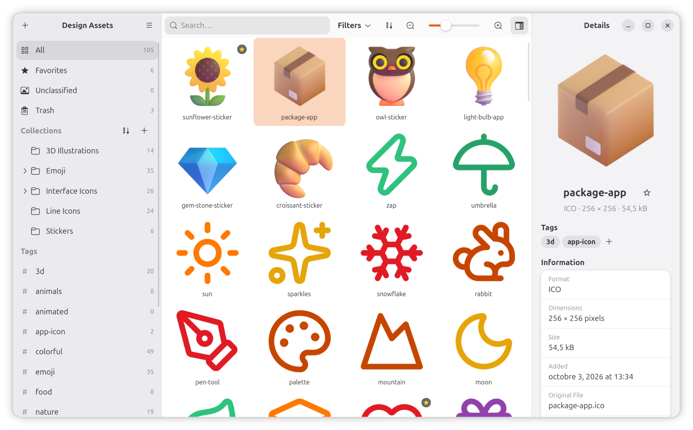

# Guide d'utilisation de Pigoune

*[English version](../en/README.md)*

Pigoune range toutes vos ressources graphiques (icônes, logos, illustrations) dans une seule
bibliothèque bien organisée. Ce guide présente tout ce qu'il sait faire.

- [Premiers pas](#premiers-pas)
- [Organiser](#organiser)
- [Retrouver une ressource](#retrouver-une-ressource)
- [Regarder vos ressources](#regarder-vos-ressources)
- [Réutiliser vos ressources](#réutiliser-vos-ressources)
- [Corbeille et annulation](#corbeille-et-annulation)
- [Votre bibliothèque](#votre-bibliothèque)
- [Préférences](#préférences)
- [Raccourcis clavier](#raccourcis-clavier)
- [Questions et réponses](#questions-et-réponses)

## Premiers pas

### Créer une bibliothèque

Une bibliothèque est un dossier dans lequel Pigoune garde une copie de vos ressources. Sur
l'écran d'accueil, choisissez **Nouvelle bibliothèque…**, donnez-lui un nom et choisissez où
l'enregistrer. Vous pouvez en créer autant que vous voulez, par exemple une par projet ou par
client.

Pour ouvrir une bibliothèque existante, choisissez **Ouvrir une bibliothèque…**. Pigoune
rouvre la dernière bibliothèque utilisée à chaque démarrage. Quand une bibliothèque est
ouverte, le menu principal propose **Nouvelle bibliothèque…** et **Ouvrir une bibliothèque…**
pour passer à une autre, et **Bibliothèques récentes** liste les dernières bibliothèques
ouvertes, cinq par défaut. La page d'accueil les affiche aussi, pour en rouvrir une d'un
clic. Sur la page d'accueil, retirez-en une de la liste avec sa croix, ou choisissez **Effacer
la liste**, là ou dans le menu : seule la liste change, les bibliothèques elles-mêmes sont
conservées.

**Fermer la bibliothèque**, dans le menu principal, ramène à la page d'accueil. Au prochain
lancement, Pigoune s'ouvre aussi sur la page d'accueil.

### Importer des ressources

Cliquez sur le bouton **+** en haut de la barre latérale, ou appuyez sur
<kbd>Ctrl</kbd>+<kbd>I</kbd>, puis choisissez **Importer des fichiers…** ou **Importer un
dossier…**. Vous pouvez aussi simplement glisser des fichiers ou des dossiers depuis Fichiers
jusque dans la fenêtre de Pigoune.

- Les formats pris en charge sont SVG, PNG, JPEG, WebP, AVIF, JPEG XL, GIF, TIFF,
  BMP et ICO.
- Pigoune vérifie chaque image avant de l'importer : un fichier abîmé est signalé au lieu
  d'être ajouté.
- Les doublons sont reconnus : un fichier déjà présent n'est jamais copié deux fois.
- Quand vous importez un dossier, ses sous-dossiers deviennent des collections.
- Vos fichiers d'origine ne sont jamais modifiés ni déplacés. Vous pouvez les supprimer une
  fois importés.

Si une collection ou un tag est sélectionné dans la barre latérale, les fichiers importés y
vont directement. Vous pouvez aussi déposer des fichiers directement sur une collection ou un
tag de la barre latérale.

## Organiser

### Les collections

Les collections fonctionnent comme des dossiers et peuvent contenir d'autres collections.
Créez-en une avec le bouton **+** à côté de **Collections**, dans la barre latérale. Un clic
droit sur une collection permet d'y créer une sous-collection, de la renommer
(<kbd>F2</kbd>), de la personnaliser ou de la supprimer.

- **Personnalisez** une collection pour lui donner sa propre icône et sa propre couleur dans la
  barre latérale : clic droit, **Personnaliser…**, choisissez une couleur et une icône, puis
  **Enregistrer**. **Par défaut** remet le dossier gris.
- **Déplacez** des ressources dans une collection en les glissant dessus depuis la grille.
- **Ajoutez-les** à une collection sans les retirer de leur place en maintenant
  <kbd>Ctrl</kbd> pendant le glisser, ou avec **Ajouter à une collection…** dans le menu du
  clic droit. Une ressource peut appartenir à plusieurs collections.
- **Retirez-les** de la collection affichée avec **Retirer de la collection** dans le menu du
  clic droit. Elles restent dans la bibliothèque et dans leurs autres collections.
- **Réorganisez** les collections en les glissant dans la barre latérale, ou triez-les par nom
  ou par date de création avec le bouton **⋯** à côté de **Collections**.
- **Repliez** une section de la barre latérale (Collections, Collections intelligentes ou Tags)
  d'un clic sur son titre, ou avec <kbd>Entrée</kbd> quand le titre a le focus du clavier.
  Pigoune retient les sections repliées.
- **Non classés** regroupe les ressources qui n'appartiennent à aucune collection.

Quand vous supprimez une collection, ses sous-collections le sont aussi, et les ressources qui
n'appartenaient qu'à elles partent dans la corbeille. Celles qui appartiennent aussi à une
autre collection y restent.

### Les tags

Les tags décrivent vos ressources avec les mots de votre choix. Ajoutez-en depuis le panneau
de détails avec le bouton **+** à côté des tags, avec **Ajouter un tag…** dans le menu du clic
droit, ou glissez des ressources sur un tag de la barre latérale. La barre latérale montre les
tags en pastilles avec leur nombre de ressources : cliquez sur l'une d'elles pour voir toutes ses
ressources, ou faites un clic droit pour la renommer ou la supprimer. Au-delà de douze tags,
**+ N autres** affiche la suite. Renommer un tag avec le nom d'un autre les fusionne.

### Les favoris

Marquez une ressource comme favorite avec l'étoile à côté de son nom, dans le panneau de
détails, ou appuyez sur <kbd>Ctrl</kbd>+<kbd>D</kbd>. Les favoris ont leur propre entrée dans
la barre latérale.

### Noms, notes et crédits

Cliquez sur le nom d'une ressource dans le panneau de détails (ou appuyez sur <kbd>F2</kbd>)
pour la renommer. Le groupe **Note et crédits** permet d'écrire une note et d'indiquer la
source, la licence et l'auteur de chaque ressource, ce qui est bien pratique au moment de la
réutiliser. Le groupe **Fichier**, en dessous, indique quand la ressource a été ajoutée et le
nom du fichier d'origine. Chaque groupe se replie et se déplie d'un clic sur son titre, qui
affiche aussi un court résumé, et Pigoune retient ceux qui sont ouverts. Sous le nom, **Ouvrir
avec…**, **Copier** et **Exporter…** agissent directement sur la ressource.

### Plusieurs ressources à la fois

Sélectionnez plusieurs ressources avec <kbd>Ctrl</kbd>+clic, <kbd>Maj</kbd>+clic, en traçant
un rectangle depuis un espace vide de la grille, ou avec <kbd>Ctrl</kbd>+<kbd>A</kbd>. Le
panneau de détails affiche alors un résumé et permet de changer les favoris et les tags de
toutes, tandis que le glisser et le menu du clic droit agissent sur toute la sélection. Un tag
porté par une partie seulement des ressources sélectionnées est entouré de pointillés : un
clic dessus l'ajoute à toutes.

## Retrouver une ressource

Cliquez dans le champ de recherche, appuyez sur <kbd>Ctrl</kbd>+<kbd>F</kbd>, ou commencez
simplement à taper. Pigoune cherche dans les noms, les tags, les notes, les sources, les
licences et les auteurs, sans tenir compte des majuscules ni des accents, dans l'entrée
sélectionnée de la barre latérale. Sélectionnez **Tout** pour chercher dans toute la
bibliothèque.

- **Espace = et.** `logo chèvre` trouve les ressources qui contiennent *logo* **et** *chèvre*,
  même à des endroits différents (par exemple *logo* dans le nom et *chèvre* dans un tag).
- **Virgule = ou.** `logo, chèvre` trouve celles qui contiennent *logo* **ou** *chèvre*.
- **Les virgules découpent la recherche en groupes** : une ressource est trouvée dès qu'elle
  contient tous les mots d'un groupe. `logo rouge, chèvre` trouve ce qui contient à la fois
  *logo* et *rouge*, ou bien *chèvre*.
- Un mot peut n'être qu'un morceau de mot : `chat` trouve aussi *château*.
- À partir de deux mots, ils apparaissent en pastilles sous le champ de recherche, reliées par
  **et** ou **ou**. Un clic sur un **ou** réunit les deux groupes voisins ; un clic sur un
  **et** coupe le groupe en deux à cet endroit. Dans `logo rouge, chèvre`, cliquer sur le
  **ou** donne `logo rouge chèvre` (les trois mots sont exigés) ; cliquer sur le **et** donne
  `logo, rouge, chèvre` (un seul suffit). La croix d'une pastille retire son mot. Les mêmes
  pastilles apparaissent sous **Mots à rechercher** dans la fenêtre des collections
  intelligentes.
- Une recherche utilise 8 mots au maximum : les suivants sont ignorés, et les pastilles
  l'indiquent.

La recherche ne regarde pas le format : pour ne garder que les SVG, par exemple, utilisez le
bouton **Filtres**, qui garde aussi, au choix, seulement vos favoris.

**Filtres** propose aussi treize couleurs. Pigoune note les couleurs principales de chaque
ressource, jusqu'à trois qui couvrent chacune au moins 15 % de l'image visible, sans compter
les zones transparentes. Choisissez rouge et bleu pour voir les ressources surtout rouges ou
bleues. La dernière pastille, arc-en-ciel, ouvre le sélecteur de couleur de GNOME pour choisir
n'importe quelle couleur, par exemple la couleur exacte d'une charte graphique : Pigoune garde
alors les ressources dont une couleur principale en est proche. Un nouveau clic la retire. Les
couleurs s'ajoutent aux types et aux favoris : rouge et SVG montrent les SVG rouges. À la première ouverture d'une bibliothèque avec Pigoune 2.0, ses ressources sont
analysées en arrière-plan pendant que vous continuez à travailler ; une ressource pas encore
analysée ne correspond à aucune couleur.

Pour savoir où une ressource est rangée, regardez **Collections** dans le groupe
**Organisation** du panneau de détails. Un clic sur une collection l'ouvre dans la barre
latérale et met la ressource en évidence. Un clic sur un tag fonctionne de la même façon.
**Couleurs détectées** montre les couleurs principales trouvées par Pigoune ; pour ne garder
que les ressources d'une couleur, utilisez le bouton **Filtres**.

### Les collections intelligentes

Une collection intelligente est une recherche enregistrée qui se tient à jour toute seule :
elle affiche toujours les ressources qui correspondent à ses critères, y compris celles que vous
importez plus tard. Par exemple, *tous mes SVG favoris* ou *tout ce qui parle de logo dans la
collection Clients*.

- **Créez-en une** avec le bouton **+** à côté de **Collections intelligentes** dans la barre
  latérale. La fenêtre est préremplie avec la recherche et les filtres en cours, et avec
  l'entrée sélectionnée dans la barre latérale. Donnez-lui un nom, puis choisissez des mots à
  rechercher, des types, des couleurs ou **Favoris seulement** : il faut au moins un critère.
- **Mots à rechercher** fonctionne exactement comme le champ de recherche : espaces et
  virgules, et pastilles dont les **et** et les **ou** coupent ou réunissent les groupes.
- **Ouvrez-la** depuis la barre latérale pour voir ses ressources. Vous pouvez encore chercher
  à l'intérieur.
- **Modifiez** son nom ou ses critères avec **Modifier…** dans son menu du clic droit, ou avec
  <kbd>F2</kbd>. **Supprimer…** ne supprime que la recherche enregistrée : les ressources
  restent dans la bibliothèque.
- **Réorganisez** les collections intelligentes en les faisant glisser dans la barre latérale,
  ou triez-les par nom ou par date de création avec le bouton **⋯** à côté de leur titre.

On ne peut pas déposer de ressources sur une collection intelligente, puisque son contenu suit
ses critères.

## Regarder vos ressources

- Changez la taille des vignettes avec le curseur au-dessus de la grille, ou avec
  <kbd>Ctrl</kbd>+<kbd>+</kbd> et <kbd>Ctrl</kbd>+<kbd>-</kbd>. Le curseur fixe la taille
  minimale : les vignettes grandissent légèrement pour que chaque rangée occupe toute la
  largeur de la fenêtre.
- Triez la grille par date d'ajout, nom, type, dimensions ou poids avec le bouton de tri.
- Les GIF, PNG et WebP animés s'animent au survol.
- Appuyez sur <kbd>Espace</kbd> ou double-cliquez sur une ressource pour ouvrir l'**aperçu
  détaillé**. Zoomez avec la molette ou avec <kbd>+</kbd> et <kbd>-</kbd>, utilisez
  <kbd>0</kbd> pour ajuster à la fenêtre et <kbd>1</kbd> pour la taille réelle, et choisissez
  une couleur de fond avec le bouton **Fond** de la barre du haut. Les boutons **Ouvrir
  avec…**, **Copier** et **Exporter vers…** placés à côté agissent sur la ressource affichée.
  Le bouton **Afficher les détails** ouvre le panneau de détails à côté de la ressource, pour la
  taguer, la ranger ou lui ajouter une note sans quitter l'aperçu ; Pigoune retient s'il est
  ouvert. Appuyez sur <kbd>Espace</kbd> ou <kbd>Échap</kbd> pour revenir.
- Passez à la ressource précédente ou suivante avec les flèches du clavier, avec les boutons
  fléchés qui apparaissent quand vous bougez la souris, ou par un balayage à deux doigts.
  <kbd>Début</kbd> et <kbd>Fin</kbd> mènent à la première et à la dernière ressource.
- Appuyez sur <kbd>F11</kbd>, ou choisissez **Plein écran** dans le menu du zoom, pour occuper
  tout l'écran ; la barre du haut revient quand vous bougez la souris, et <kbd>Échap</kbd> quitte
  le plein écran.
- Pour un fichier ICO qui contient plusieurs tailles, des boutons sous l'image affichent chaque
  taille telle qu'elle a été dessinée (16, 32, 48, 256…).
- Pour une animation, une barre sous l'image la met en pause, la relance et la parcourt image
  par image, en indiquant l'image affichée. Au clavier, <kbd>K</kbd> met en pause ou relance,
  <kbd>,</kbd> et <kbd>.</kbd> affichent l'image précédente et suivante.
- Dans l'aperçu, faites glisser l'image pour en examiner n'importe quelle partie, même un coin
  amené au milieu de l'écran. Un contour en pointillés montre les vrais bords de l'image,
  marges transparentes comprises ; désactivez-le avec **Afficher les limites de l’image** dans
  le menu du zoom.
- À partir de 800 %, une grille légère sépare les pixels des images, pratique pour vérifier
  une icône ou du pixel art ; désactivez-la avec **Afficher la grille des pixels** dans le menu
  du zoom.
- Une bande de vignettes en bas de l'aperçu montre les ressources voisines ; cliquez sur l'une
  d'elles pour l'afficher. Elle est masquée en plein écran et dans les fenêtres étroites ;
  désactivez-la avec **Afficher la bande de vignettes** dans le menu du zoom.
- L'étoile à côté du bouton de retour ajoute la ressource affichée à vos favoris, et un clic droit
  sur l'image propose **Ouvrir avec…**, **Copier**, **Exporter vers…**, **Exporter au format…**
  et **Ajouter aux favoris** pour elle.

## Réutiliser vos ressources

- **Glissez** des ressources depuis la grille vers n'importe quelle application (un éditeur de
  texte, un logiciel de graphisme, une page web…). Pigoune y dépose une copie qui porte le nom
  de la ressource.
- **Copiez-les** avec <kbd>Ctrl</kbd>+<kbd>C</kbd> pour les coller ailleurs.
- **Exportez-les** dans un dossier avec **Exporter vers…** dans le menu du clic droit. Les
  fichiers existants ne sont jamais écrasés.
- **Convertissez-les** avec **Exporter au format…** dans le menu du clic droit : choisissez PNG,
  JPEG, WebP, AVIF ou ICO, puis un dossier. JPEG et AVIF proposent un réglage de qualité ; le
  JPEG n'a pas de transparence, une couleur de fond remplit donc les zones transparentes ; les
  autres formats gardent la transparence, sauf si vous désactivez **Garder la transparence**
  pour utiliser aussi une couleur de fond. Choisissez la largeur et la hauteur, en pixels ou en
  pourcentage ; 100 % garde la taille d'origine. Cadenas fermé, les proportions sont gardées :
  changer un côté ajuste l'autre, et plusieurs images de formes différentes tiennent chacune
  dans la largeur et la hauteur indiquées. Ouvrez-le pour étirer librement une image. Un SVG
  reste net à toutes les tailles ; une image en pixels agrandie devient floue. Un fichier
  redimensionné porte sa taille dans son nom, par exemple `logo-512x384.png`. Depuis l'aperçu,
  une animation en pause sur une image exporte cette image, nommée par exemple
  `spinner-image-3.png`. Pour l'ICO, cochez les tailles à inclure (16, 32, 48 et 256 par défaut)
  : elles vont toutes dans un seul fichier d'icône. Pigoune retient votre format, votre qualité,
  votre fond et votre unité pour le prochain export, et la taille repart toujours de l'original.
  L'original reste intact dans la bibliothèque, et les fichiers existants ne sont jamais
  écrasés.
- **Ouvrez** une ressource dans une autre application, un logiciel de retouche par exemple,
  avec **Ouvrir avec…** dans le menu du clic droit. L'application reçoit une copie : votre
  bibliothèque reste intacte, enregistrez donc vos modifications sous un nouveau nom et
  importez-les si vous voulez les garder.

## Corbeille et annulation

Appuyez sur <kbd>Suppr</kbd>, ou choisissez **Mettre à la corbeille** dans le menu du clic
droit, pour envoyer des ressources à la corbeille. Rien n'est perdu tant que vous ne la videz
pas : ouvrez **Corbeille**, en bas de la barre latérale, pour restaurer des ressources, avec
**Restaurer** dans le menu du clic droit ou dans le panneau de détails, ou pour la vider
définitivement.

La plupart des modifications s'annulent avec <kbd>Ctrl</kbd>+<kbd>Z</kbd> ou avec le bouton
**Annuler** du message qui apparaît après une action : mise à la corbeille, déplacement, tags,
favoris, renommage, notes et crédits, mais aussi création, renommage, personnalisation,
déplacement ou suppression d'une collection, et création, modification, réorganisation ou
suppression d'une collection intelligente. Les imports ne s'annulent pas, et vider la corbeille
efface l'historique des annulations. La création d'une collection ne s'annule que tant qu'elle
est vide : une fois des ressources importées dedans, utilisez plutôt **Supprimer…**.

## Votre bibliothèque

Une bibliothèque est un simple dossier dont le nom se termine par `.pigoune`. Il contient :

- `files/`, une copie de chaque ressource, avec son nom de fichier d'origine, rangée dans de
  petits sous-dossiers pour que même une très grande bibliothèque reste facile à manipuler ;
- `library.db`, la base de données qui contient les collections, les tags et toutes les
  autres informations ;
- `cache/`, les vignettes, que Pigoune peut refaire à tout moment.

Comme tout se trouve dans ce dossier, une bibliothèque est **portable** : copiez-la sur un
disque externe ou sur un autre ordinateur et ouvrez-la là-bas avec Pigoune. Pour la
sauvegarder, copiez le dossier entier pendant que Pigoune est fermé.

Une bibliothèque ne peut être ouverte que dans une seule fenêtre de Pigoune à la fois. Si vous
la gardez dans un dossier synchronisé (Nextcloud, Syncthing…), fermez Pigoune sur un
ordinateur avant de l'ouvrir sur un autre.

Choisissez **Informations sur la bibliothèque** dans le menu principal pour voir ce que contient
la bibliothèque ouverte, en trois onglets :

- **Aperçu** montre le nom et l'emplacement de la bibliothèque, le nombre de ressources, de
  collections, de tags et de favoris, et les **Records** : la ressource la plus lourde, la plus
  grande, la plus récente et la plus ancienne ; cliquez sur l'une d'elles pour la voir dans la
  grille.
- **Contenu** montre dans un graphique en anneau comment la place se répartit entre les formats,
  en poids ou en nombre de ressources, le nombre d'images animées, de SVG et de ressources dans la
  corbeille, et les couleurs détectées avec le nombre de ressources dont chacune est une couleur
  principale.
- **Stockage** montre dans une seule barre la place de la bibliothèque sur son disque, répartie
  entre les ressources, les vignettes, la base de données et la corbeille, à côté des autres
  fichiers et de l'espace libre. En dessous : son emplacement, avec des boutons pour le copier ou
  ouvrir son dossier, si ce disque est amovible, sa date de création et les versions de Pigoune
  capables de l'ouvrir.

## Préférences

Ouvrez les **Préférences** depuis le menu principal, ou appuyez sur
<kbd>Ctrl</kbd>+<kbd>,</kbd>. Les réglages sont répartis sur trois pages ; la loupe en haut
retrouve un réglage par son nom.

**Général**

- **Rouvrir la dernière bibliothèque** : au lancement, Pigoune ouvre la bibliothèque laissée
  ouverte. Désactivez-le pour partir de la page d'accueil et choisir une bibliothèque à chaque
  fois.
- **Bibliothèques récentes** : combien de bibliothèques récentes le menu principal et la page
  d'accueil proposent, de 0 à 8. Choisissez 0 pour désactiver la liste.
- **Rouvrir la dernière entrée** : une bibliothèque s'ouvre sur l'entrée utilisée la dernière
  fois plutôt que sur **Tout**.
- **Confirmer avant de vider la corbeille**.
- **Vider automatiquement la corbeille** : les ressources sont supprimées définitivement après
  30 jours dans la corbeille.
- **Vignettes**, dans **Stockage**, indique la place prise par les vignettes de la bibliothèque
  ouverte. **Vider** la libère ; les vignettes sont recréées quand on en a besoin.

**Affichage**

- **Afficher le nom des ressources** sous chaque vignette de la grille. Quand les noms sont
  masqués, survolez une vignette pour voir son nom.
- **Afficher les formats** : une étiquette indique le format de chaque ressource (SVG, PNG…)
  sur sa vignette.
- **Fond des vignettes** : blanc, gris, noir ou damier derrière les vignettes, pour voir les
  images blanches ou noires et les zones transparentes.
- **Animer les vignettes au survol** : désactivez-le si les vignettes qui bougent vous
  distraient ; les animations se jouent toujours dans le panneau de détails et l'aperçu.
- **Afficher le nombre de ressources** à côté de chaque entrée de la barre latérale.
- **Afficher les tags** : désactivez-le pour masquer la section des tags de la barre latérale.
  Les tags restent visibles dans le panneau de détails, et la recherche les trouve toujours.
- **Afficher les collections intelligentes** : désactivez-le pour masquer la section des
  collections intelligentes de la barre latérale. Vos collections intelligentes sont conservées
  et reviennent quand vous le réactivez.

**Comportement**

- **Ouvrir les ressources au double-clic** : un double-clic ouvre la ressource dans son
  application par défaut au lieu de l'aperçu. La touche <kbd>Espace</kbd> ouvre toujours
  l'aperçu.
- **Rechercher dans toute la bibliothèque** : la recherche et les filtres regardent partout,
  et pas seulement dans l'entrée sélectionnée de la barre latérale, sauf dans la corbeille et
  dans les collections intelligentes.

Pigoune suit le style et la couleur d'accentuation choisis dans les **Paramètres** de GNOME,
rubrique **Apparence** : style clair ou sombre, et couleur des sélections, des interrupteurs et
des surlignages.

## Raccourcis clavier

Appuyez sur <kbd>Ctrl</kbd>+<kbd>?</kbd> pour voir tous les raccourcis de Pigoune.

| Action | Raccourci |
|---|---|
| Nouvelle bibliothèque | <kbd>Ctrl</kbd>+<kbd>N</kbd> |
| Ouvrir une bibliothèque | <kbd>Ctrl</kbd>+<kbd>O</kbd> |
| Importer des fichiers | <kbd>Ctrl</kbd>+<kbd>I</kbd> |
| Rechercher | <kbd>Ctrl</kbd>+<kbd>F</kbd> |
| Aperçu détaillé | <kbd>Espace</kbd> |
| Tout sélectionner / tout désélectionner | <kbd>Ctrl</kbd>+<kbd>A</kbd> / <kbd>Échap</kbd> |
| Copier | <kbd>Ctrl</kbd>+<kbd>C</kbd> |
| Renommer | <kbd>F2</kbd> |
| Ajouter aux favoris ou en retirer | <kbd>Ctrl</kbd>+<kbd>D</kbd> |
| Mettre à la corbeille | <kbd>Suppr</kbd> |
| Renommer ou modifier l'entrée sélectionnée dans la barre latérale | <kbd>F2</kbd> |
| Supprimer la collection sélectionnée dans la barre latérale | <kbd>Suppr</kbd> |
| Annuler | <kbd>Ctrl</kbd>+<kbd>Z</kbd> |
| Vignettes plus grandes / plus petites | <kbd>Ctrl</kbd>+<kbd>+</kbd> / <kbd>Ctrl</kbd>+<kbd>-</kbd> |
| Menu contextuel | <kbd>Menu</kbd> ou <kbd>Maj</kbd>+<kbd>F10</kbd> |
| Aide | <kbd>F1</kbd> |
| Préférences | <kbd>Ctrl</kbd>+<kbd>,</kbd> |
| Quitter | <kbd>Ctrl</kbd>+<kbd>Q</kbd> |

## Questions et réponses

**Puis-je supprimer mes fichiers d'origine après les avoir importés ?**
Oui. Pigoune travaille sur ses propres copies, rangées dans la bibliothèque.

**Pigoune envoie-t-il quelque chose sur internet ?**
Non. Pigoune fonctionne entièrement hors ligne, sans compte et sans télémétrie. La recherche de
mises à jour est faite par Flatpak, qui demande seulement au dépôt de Pigoune si une nouvelle
version existe.

**Comment mettre Pigoune à jour ?**
Quand une nouvelle version sort, une bannière en haut de la fenêtre l'annonce. Cliquez sur
**Mettre à jour**, attendez la fin de l'installation, puis cliquez sur **Redémarrer**. Logiciels
et `flatpak update` l'installent aussi.

**Pourquoi Pigoune dit-il qu'un fichier est illisible ?**
Le fichier est abîmé, ou n'est pas vraiment dans le format qu'indique son nom. Pigoune vérifie
le contenu de chaque image, pas seulement son extension.

**J'ai importé deux fois le même fichier. Où est la deuxième copie ?**
Il n'y en a pas : Pigoune reconnaît les doublons et ajoute plutôt la ressource existante à la
collection visée.

**Comment signaler un bug ou proposer une idée ?**
Ouvrez une issue sur [GitHub](https://github.com/Gor3pig/Pigoune/issues).
